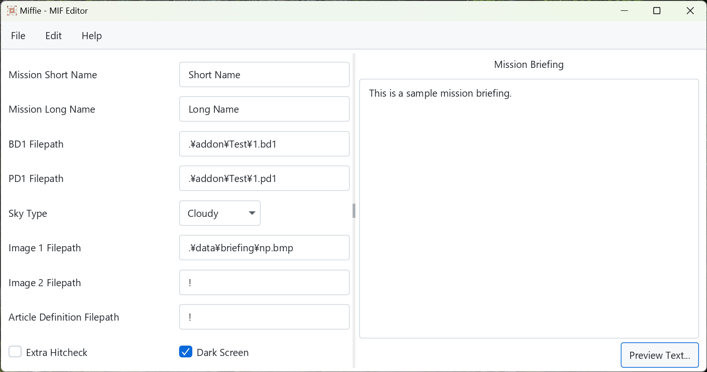

# Miffie - MIF Editor



## Overview

**Miffie** is a MIF editor that comes with refined modern UI, and its properties are customizable to *my* heart's content; but I hope you *xopsplayers* would also enjoy this brand-new tool for your life that couldn't do without a blessing from [X operations](https://hp.vector.co.jp/authors/VA022962/xops/).

Supported platforms are as follows:

- Windows x64
- Linux x64
- macOS x64

## How to add a new display language

Text properties are defined in the files under `./Data/Properties` directory.
Views have their properties for each of the supported languages.

Say, if you want to translate the texts of the main view to French, you have to create `main_view_fr.properties` and populate it with French translation.
You could copy and paste from `main_view_en.properties` and call it a starting point.
You also have to work on other views.

Once translation is done, register your language in `./Data/languages.yaml` as follows:

```yaml
languages:
  - code: fr
    localName: Français
    enName: French
```

If your translation is still in beta for some reason, then set `beta` to `true`.

```yaml
languages:
  - code: fr
    localName: Français
    enName: French
    beta: true
```

Voila, your language will appear in the preferences view the next time you start the app!

## For developers

You can start the app with `mvn javafx:run`.

## Known issues

### Terminal is shown along with main application window

This affects especially to Windows users.
There is no easy way to hide the terminal opened when running a .bat file, so I have decided to leave it as it is.
Some custom launcher for Windows (maybe .exe) might be developed in the future, but currently there is no such plan.
I apologize for degrading your experience.

